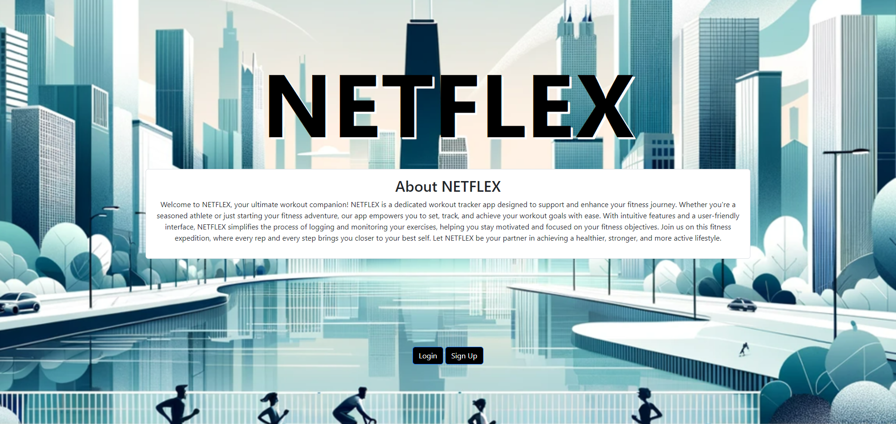

<!-- Improved compatibility of back to top link: See: https://github.com/othneildrew/Best-README-Template/pull/73 -->
<div id="readme-top"></div>
<!--
*** Thanks for checking out the Best-README-Template. If you have a suggestion
*** that would make this better, please fork the repo and create a pull request
*** or simply open an issue with the tag "enhancement".
*** Don't forget to give the project a star!
*** Thanks again! Now go create something AMAZING! :D
-->

<!-- PROJECT SHIELDS -->
<!--
*** I'm using markdown "reference style" links for readability.
*** Reference links are enclosed in brackets [ ] instead of parentheses ( ).
*** See the bottom of this document for the declaration of the reference variables
*** for contributors-url, forks-url, etc. This is an optional, concise syntax you may use.
*** https://www.markdownguide.org/basic-syntax/#reference-style-links
-->

[![Contributors][contributors-shield]][contributors-url]
[![Forks][forks-shield]][forks-url]
[![Stargazers][stars-shield]][stars-url]
[![Issues][issues-shield]][issues-url]
[![MIT License][license-shield]][license-url]
<!-- [![LinkedIn][linkedin-shield]][linkedin-url] -->

<!-- PROJECT LOGO -->
<br />
<div align="center">
  <!-- <a href="https://github.com/Project2Team1GPR/NETFLEX">
    
  </a> -->

<h3 align="center">NETFLEX</h3>

  <p align="center">
    <br />
    <a href="https://github.com/Project2Team1GPR/NETFLEX"><strong>Explore the docs »</strong></a>
    <br />
    <br />
    <a href="https://github.com/Project2Team1GPR/NETFLEX">View Demo</a>
    ·
    <a href="https://github.com/Project2Team1GPR/NETFLEX/issues">Report Bug</a>
    ·
    <a href="https://github.com/Project2Team1GPR/NETFLEX/issues">Request Feature</a>
  </p>
</div>

<!-- TABLE OF CONTENTS -->
<details>
  <summary>Table of Contents</summary>
  <ol>
    <li>
      <a href="#about-the-project">About The Project</a>
      <ul>
        <li><a href="#built-with">Built With</a></li>
      </ul>
    </li>
    <li>
      <a href="#getting-started">Getting Started</a>
      <ul>
        <!-- <li><a href="#prerequisites">Prerequisites</a></li> -->
        <li><a href="#installation">Installation</a></li>
      </ul>
    </li>
    <li><a href="#usage">Usage</a></li>
    <!-- <li><a href="#roadmap">Roadmap</a></li> -->
    <li><a href="#contributing">Contributing</a></li>
    <li><a href="#license">License</a></li>
    <li><a href="#contact">Contact</a></li>
    <li><a href="#acknowledgments">Acknowledgments</a></li>
  </ol>
</details>

<!-- ABOUT THE PROJECT -->

## Description

<!-- Enter Description Below -->

Welcome to NETFLEX, your ultimate workout companion! NETFLEX is a dedicated workout tracker app designed to support and enhance your fitness journey. Whether you're a seasoned athlete or just starting your fitness adventure, our app empowers you to set, track, and achieve your workout goals with ease. With intuitive features and a user-friendly interface, NETFLEX simplifies the process of logging and monitoring your
exercises, helping you stay motivated and focused on your fitness objectives. Join us on this fitness
expedition, where every rep and every step brings you closer to your best self. Let NETFLEX be your partner in achieving a healthier, stronger, and more active lifestyle.

### User Story
As a fitness enthusiast user,<br>
I want a dedicated workout tracking app that caters to both seasoned athletes and beginners,<br>
So that I can effortlessly set, monitor, and achieve my fitness goals, staying motivated throughout my fitness journey.


[](https://project2-team1-netflex.onrender.com/)

<!-- Here's a blank template to get started: To avoid retyping too much info. Do a search and replace with your text editor for the following: `Project2Team1GPR`, `NETFLEX`, `gavinpmeyer`, `gmail`, `gpmeyer24`, `project_title`, `project_description` -->

<p align="right">(<a href="#readme-top">Back To Top</a>)</p>

### Built With

<!-- * [![Next][Next.js]][Next-url]
* [![React][React.js]][React-url]
* [![Vue][Vue.js]][Vue-url]
* [![Angular][Angular.io]][Angular-url]
* [![Svelte][Svelte.dev]][Svelte-url]
* [![Laravel][Laravel.com]][Laravel-url] -->

- [![Bootstrap][Bootstrap.com]][Bootstrap-url]
<!-- * [![JQuery][JQuery.com]][JQuery-url] -->
- [![JavaScript][JavaScript.com]][JavaScript-url]
- [![node.js][node.js.org]][node.js-url]
- [![Express.js][express.js.com]][express.js-url]
- [![Render][render.com]][render-url]
- [![Font Awesome][fontawesome.com]][fontawesome-url]

<p align="right">(<a href="#readme-top">Back To Top</a>)</p>

<!-- GETTING STARTED -->

## Getting Started

<!-- ### Prerequisites

This is an example of how to list things you need to use the software and how to install them.

- npm
  ```sh
  npm install npm@latest -g
  ``` -->

### Installation

1. Run 'npm install' in the command-line

### Command-line Steps after Installation
1. Open the terminal
2. In the command-line enter 'nodemon server.js'

<p align="right">(<a href="#readme-top">back to top</a>)</p>

<!-- USAGE EXAMPLES -->

## Usage

### Walkthrough Video

[](https://project2-team1-netflex.onrender.com/)


<p align="right">(<a href="#readme-top">Back To Top</a>)</p>

<!-- ROADMAP -->
<!-- ## Roadmap

- [ ] Feature 1
- [ ] Feature 2
- [ ] Feature 3
    - [ ] Nested Feature

See the [open issues](https://github.com/Project2Team1GPR/NETFLEX/issues) for a full list of proposed features (and known issues).

<p align="right">(<a href="#readme-top">Back To Top</a>)</p> -->

<!-- CONTRIBUTING -->

## Contributing

Contributions are what make the open source community such an amazing place to learn, inspire, and create. Any contributions you make are **greatly appreciated**.

If you have a suggestion that would make this better, please fork the repo and create a pull request. You can also simply open an issue with the tag "enhancement".
Don't forget to give the project a star! Thanks again!

1. Fork the Project
2. Create your Feature Branch (`git checkout -b feature/AmazingFeature`)
3. Commit your Changes (`git commit -m 'Add some AmazingFeature'`)
4. Push to the Branch (`git push origin feature/AmazingFeature`)
5. Open a Pull Request

<p align="right">(<a href="#readme-top">Back To Top</a>)</p>

<!-- LICENSE -->

## License

Distributed under the MIT License. See `LICENSE.txt` for more information.

<p align="right">(<a href="#readme-top">Back To Top</a>)</p>

<!-- CONTACT -->

## Contact

Gavin Meyer | Email: gpmeyer24@gmail.com | GitHub: Project2Team1GPR

Jenni Park | Email: hjipark22@gmail.com | GitHub: hjenp22

Sean Harrigan | Email:  | GitHub: seanharrigan8

Project Link: [GitHub Repo](https://github.com/Project2Team1GPR/NETFLEX)

Deployed Link: [NETFLEX](https://project2-team1-netflex.onrender.com/)

<p align="right">(<a href="#readme-top">Back To Top</a>)</p>

<!-- ACKNOWLEDGMENTS -->

## Acknowledgments

- [W3Schools](https://www.w3schools.com/)
- Jose Lopez - Tutor
- ChatGPT
- Rich Hosek & Vince Teune - Instructor & TA

<p align="right">(<a href="#readme-top">Back To Top</a>)</p>

<!-- MARKDOWN LINKS & IMAGES -->
<!-- https://www.markdownguide.org/basic-syntax/#reference-style-links -->

[contributors-shield]: https://img.shields.io/github/contributors/Project2Team1GPR/NETFLEX.svg?style=for-the-badge
[contributors-url]: https://github.com/Project2Team1GPR/NETFLEX/graphs/contributors
[forks-shield]: https://img.shields.io/github/forks/Project2Team1GPR/NETFLEX.svg?style=for-the-badge
[forks-url]: https://github.com/Project2Team1GPR/NETFLEX/network/members
[stars-shield]: https://img.shields.io/github/stars/Project2Team1GPR/NETFLEX.svg?style=for-the-badge
[stars-url]: https://github.com/Project2Team1GPR/NETFLEX/stargazers
[issues-shield]: https://img.shields.io/github/issues/Project2Team1GPR/NETFLEX.svg?style=for-the-badge
[issues-url]: https://github.com/Project2Team1GPR/NETFLEX/issues
[license-shield]: https://img.shields.io/github/license/Project2Team1GPR/NETFLEX.svg?style=for-the-badge
[license-url]: https://github.com/Project2Team1GPR/NETFLEX/blob/master/LICENSE.txt
[linkedin-shield]: https://img.shields.io/badge/-LinkedIn-black.svg?style=for-the-badge&logo=linkedin&colorB=555
[linkedin-url]: https://linkedin.com/in/gavinpmeyer
[product-screenshot]: images/screenshot.png
[Next.js]: https://img.shields.io/badge/next.js-000000?style=for-the-badge&logo=nextdotjs&logoColor=white
[Next-url]: https://nextjs.org/
[React.js]: https://img.shields.io/badge/React-20232A?style=for-the-badge&logo=react&logoColor=61DAFB
[React-url]: https://reactjs.org/
[Vue.js]: https://img.shields.io/badge/Vue.js-35495E?style=for-the-badge&logo=vuedotjs&logoColor=4FC08D
[Vue-url]: https://vuejs.org/
[Angular.io]: https://img.shields.io/badge/Angular-DD0031?style=for-the-badge&logo=angular&logoColor=white
[Angular-url]: https://angular.io/
[Svelte.dev]: https://img.shields.io/badge/Svelte-4A4A55?style=for-the-badge&logo=svelte&logoColor=FF3E00
[Svelte-url]: https://svelte.dev/
[Laravel.com]: https://img.shields.io/badge/Laravel-FF2D20?style=for-the-badge&logo=laravel&logoColor=white
[Laravel-url]: https://laravel.com
[Bootstrap.com]: https://img.shields.io/badge/Bootstrap-563D7C?style=for-the-badge&logo=bootstrap&logoColor=white
[Bootstrap-url]: https://getbootstrap.com
[JQuery.com]: https://img.shields.io/badge/jQuery-0769AD?style=for-the-badge&logo=jquery&logoColor=white
[JQuery-url]: https://jquery.com
[JavaScript.com]: https://img.shields.io/badge/JavaScript-323330?style=for-the-badge&logo=javascript&logoColor=F7DF1E
[JavaScript-url]: https://www.javascript.com/
[node.js.org]: https://img.shields.io/badge/node.js-green.svg
[node.js-url]: https://nodejs.org/en
[express.js.com]: https://img.shields.io/badge/express.js-blue.svg
[express.js-url]: https://expressjs.com/
[render.com]: https://img.shields.io/badge/render-purple.svg
[render-url]: https://render.com/
[fontawesome.com]: https://img.shields.io/badge/FontAwesome-blue.svg
[fontawesome-url]: https://fontawesome.com/
